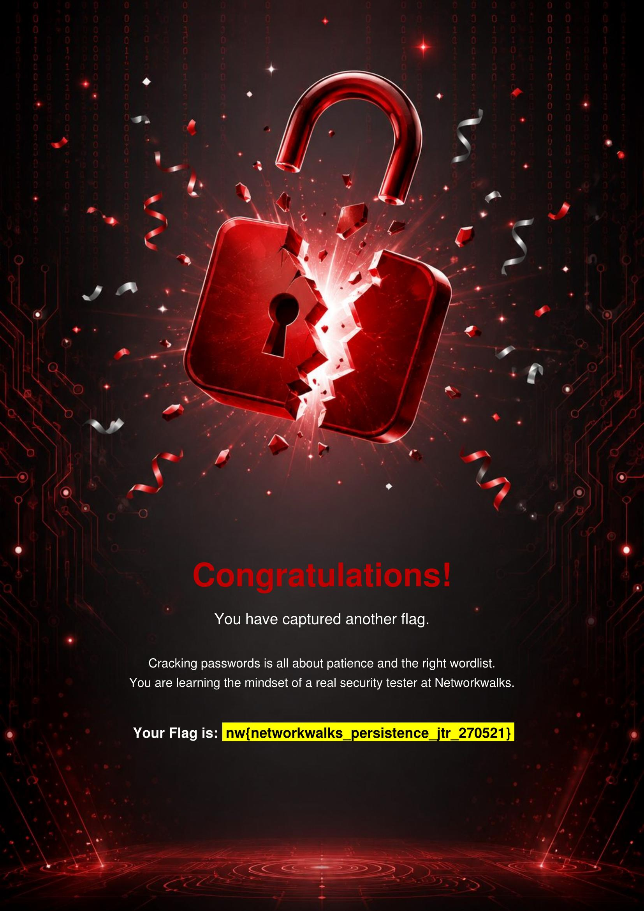

# **PENETRATION TESTING REPORT**

## PASSWORD CRACKING

W3-PM1 | W3-PM2 | CYBERSECURITY |  NETWORKWALKS

| **Penetration Tester** /(Cybersecurity Professional) | Jeffrey Obi |
| :---- | :---- |
| **Program/Batch** | B083-Networkwalks |
| **Date** | 26 September, 2026 |
| **Modules completed** | W3-PM1: Jack the Ripper (Windows) W3-PM2: Networkwalks Tools (Web) |
| **Target Files** | 1\. My Locked PDF1.pdf 2\. My Locked PDF2.pdf |
| **Download (PDF)** |  |

# **1\. Liability Disclaimer**

This project was undertaken for educational purposes **ONLY.*** All activities were performed only on the systems, devices and networks that I own, myself. This project was executed for education and research purposes **ONLY.*** Do not use anything from here to break the law. The instructor, the author and Networkwalks are not responsible for what you do with this knowledge. Every action you take is your own responsibility. Misuse can lead to criminal charges, heavy fines, loss of your job and a permanent record. In most countries unauthorized access is a crime, even when nothing is damaged.

# **2\. Introduction**

This report covers password cracking tasks performed on password encrypted PDF files provided by the instructor for the purposes of this project. The tools used were accessed locally on a Windows machine and accessed online. One module covers the use of **John the Ripper** (Windows) and **Open Hashcrack** (Web) and the use of **Hash Cracker** and **Password Cracker** (both Web tools). These tools were used to discover the passwords of the encrypted PDF files and access them. It is the Week 3 part of my ongoing internship program at Networkwalks.

All tasks were undertaken in a Windows PC with John the Ripper installed, and in a Firefox browser. Every step below includes the exact process used, the results I observed, screenshots as evidence, and short notes on lessons learned.

# **3\. Tools Used**

The table below lists each tool used in this report and its purpose.

| Tool | Purpose |
| :---- | :---- |
| **Lenovo Thinkpad** | Machine used for the project. |
| **Windows** | Operating system used for file password cracking activities. |
| **Online Hashcrack** | Online web tool used to extract hashes and use them to crack passwords. |
| **John the Ripper** | Windows tool used to crack passwords using extracted password hashes. |
| **Networkwalks's Hash Calculator** | Online web tool for hash extraction and password cracking. |
| **Networkwalks's Password Cracker** | Online web tool for cracking file passwords using the extracted hash. |
| **GitHub** | Project reporting. |

# **4\. Activities Performed**

I cracked the encryptions of 2 provided password-protected PDF files (**'My Locked PDF1.pdf'** and **'My Locked PDF2.pdf'**) using three different tools: Openwall's **John the Ripper,** Networkwalk's **Hash Calculator,** and Networkwalk's **Password Cracker.** Each tool was used in combination with another to execute each password cracking task.

## **4.1 John the Ripper & Online Hashcrack**

The online web tool, **Online Hashcrack,** was used to extract the password hash of the provided PDF file (**'My Locked PDF1.pdf'**) and then **John the Ripper** was used with the hash to crack the password. The PDF file was then accessed to find the contents which follow:

**Flag: nw{cybersecurity_flag_captured_2608}**

## **4.2 Networkwalks' Hash Calculator & Password Cracker**

The online web tools provided by Networkwalks were implemented in this module. **Hash Calculator** was used to extract the password hash of the provided PDF file (**'My Locked PDF2.pdf'**) and then I used **Password Cracker** to crack the password using the aforementioned hash. The PDF file was then accessed to find the contents which follow:

**Flag: nw{networkwalks_persistence_jtr_270521}**

# **5\. Risk Analysis / Impact**

Based on the information collected during the password cracking activities, I identified the following potential risks.

| \# | Risk / Finding | Evidence / Observation | Potential Impact | Risk Level |
| :---: | ----- | ----- | ----- | :---: |
| 1 | Weak passwords were easy to crack | Both non-complex 9-character passwords were cracked in seconds | Attackers may use these cracking tools to easily break into encrypted PDF documents containing highly sensitive information | **High** |
| 2 | Password protection is flawed | Using these tools, I realized that password cracking can only be delayed with complexity | Attackers may implement abundant compute resources and time for password cracking activities, overcoming the barrier of password complexity | **High** |

The risks above are observations from the password cracking exercises, not confirmed vulnerabilities.

# **6\. Recommendations**

Based on the observations from these activities, I recommend the following security improvements:

1. **Use long and complex passwords**  
   Organizations should implement robust password policies, from complexity to length to frequent rotation, providing a difficult barrier to password cracks.

2. **Consider alternative document security access controls**  
   Alternatives to accessible password-protected PDF files should be considered. For sensitive information, transferable password-protected PDF documents are inherently vulnerable. Alternatives like remotely accessible documents with high-strength MFA and defense-in-depth strategies may be ideal for document security.

# **7\. Conclusion**

During Week 3 of my Cybersecurity & Ethical Hacking internship, I completed practical activities covering password cracking.

In the both modules, I combined two different pairs of tools to extract the password hashes of two different password-protected PDF files and crack them. The tools were both local and web-based. I learned how they work independently and how they paired with other tools to achieve password cracking goals.

The exercises reinforced the importance of robust passwords and highlighted the limitation of this security strategy when used independently. I also learned that technical findings and understandings should be documented clearly. A good cybersecurity report should explain what was performed, what was discovered, what the observation means, what risk it may create, and what can be done to reduce that risk. The full report (PDF) can be downloaded and viewed 

Finally, I learned that password cracking must always be performed within an authorized scope, with respect to ethical obligations. These activities were completed as part of the assigned educational cybersecurity lab.

# **8\. Evidence Collected**

## **Module 1: John the Ripper & Online Hashcrack**

## **Module 2: Networkwalks' Hash Calculator & Password Cracker**

**Author**  
Jeffrey Obi  
Cybersecurity Professional B083

LinkedIn: [https://www.linkedin.com/in/jeffreyoo/](https://www.linkedin.com/in/jeffreyoo/) 

---
